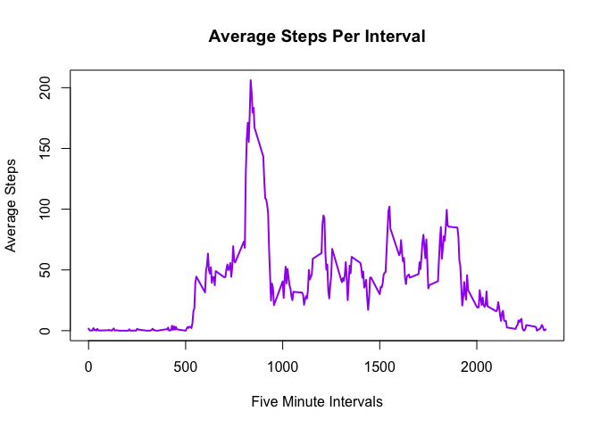

# Reproducible Research: Peer Assessment 1
J Go  
June 12, 2016  

## Loading and preprocessing the data
### fork/clone the Coursera repository
### manually fork course project 1 from course github to personal github
```
Open Safari web browser
Login to my github account at https://github.com/JGoDC/
Open another tab for coursera course repo at:
http://github.com/rdpeng/RepData_PeerAssessment1
Click on fork on course github repo page in browser
Select proper destination since a choice exists
Now have forked repo at:
https://github.com/JGoDC/RepData_PeerAssessment1
```
### manually clone course project 1 from github to local machine
```
$ cd ~/coursera/r
$ git clone https://github.com/JGoDC/RepData_PeerAssessment1
Now have cloned repo in new directory on local machine with following files:
~/coursera/r/RepData_PeerAssessment1
drwxr-xr-x  3 j  staff    102 Jun  2 20:34 instructions_fig
drwxr-xr-x  3 j  staff    102 Jun  2 20:34 doc
-rw-r--r--  1 j  staff  53559 Jun  2 20:34 activity.zip
-rw-r--r--  1 j  staff   7776 Jun  2 20:34 README.md
-rw-r--r--  1 j  staff    358 Jun  2 20:34 PA1_template.Rmd
```
### note clone date and time from timestamp on files
```
Jun 02, 2016, 20:34 EST
```
### require needed packages

```r
library(dplyr)
```

```
## 
## Attaching package: 'dplyr'
## 
## The following objects are masked from 'package:stats':
## 
##     filter, lag
## 
## The following objects are masked from 'package:base':
## 
##     intersect, setdiff, setequal, union
```

```r
library(lubridate)      # for date functions
library(ggplot2)
```

### examine current directory and current files

```r
getwd()
```

```
## [1] "/Users/j/coursera/r/RepData_PeerAssessment1"
```

```r
dir(full.names = TRUE, recursive = TRUE)
```

```
##  [1] "./activity.zip"                                                                  
##  [2] "./arc/proj1.R.v1"                                                                
##  [3] "./arc/proj1.R.v2"                                                                
##  [4] "./data/activity.csv"                                                             
##  [5] "./doc/instructions.pdf"                                                          
##  [6] "./instructions_fig/sample_panelplot.png"                                         
##  [7] "./PA1_template_files/figure-html/make_panel_plot-1.png"                          
##  [8] "./PA1_template_files/figure-html/mean_steps_by_5_minute_intervals-1.png"         
##  [9] "./PA1_template_files/figure-html/summarise_total_steps_by_date_without_NAs-1.png"
## [10] "./PA1_template_files/figure-html/summarise_total_steps_by_date-1.png"            
## [11] "./PA1_template.html"                                                             
## [12] "./PA1_template.md"                                                               
## [13] "./PA1_template.Rmd"                                                              
## [14] "./proj1.R"                                                                       
## [15] "./README.md"
```
### check for "data" directory, create if necessary

```r
data_dir="./data"
if (!file.exists(data_dir)) {
    dir.create(data_dir)
} else {
    cat('data dir exists from previous run: [', data_dir, ']', '\n')
}
```

```
## data dir exists from previous run: [ ./data ]
```

### check for activity.csv file, unzip activity.zip into data dir if necessary

```r
data_file <- paste0(file.path(".", "data", "activity.csv"))
if(!file.exists(data_file)) {
        zip_file <- "activity.zip"
        unzip(zip_file, exdir = data_dir )
} else {
    cat('data file exists from previous run: [', data_file, ']', '\n')
}
```

```
## data file exists from previous run: [ ./data/activity.csv ]
```

### read input data file with read.csv

```r
dat <- read.csv( "./data/activity.csv", sep=",", stringsAsFactors = FALSE )
```

### summarise total steps by date, create a histogram plot:

```r
dat_df <- tbl_df(dat)
dat_date_total_steps <- summarise(group_by(dat_df, date), sum(steps, na.rm = T))
unique_dates <- as.Date(names(table(dat$date)))
step_totals <- as.numeric(unlist(dat_date_total_steps[2]))

plot(unique_dates, step_totals, type="s", lwd=2, col="green", pch=2, 
     xlab="Dates", ylab="Total Steps", main="Total Steps Per Day")
lines(unique_dates, step_totals, type="h", lwd=2, col="green")
```

 

## What is mean and median of the total number of steps taken per day?

```r
# mean steps taken in a day over the entire 61 day period [9354.23]
mean_of_total_steps_per_day <- mean(as.numeric(unlist(dat_date_total_steps[,2])))
# median steps taken in a day over the entire 61 day period [10395]
median_of_total_steps_per_day <- median(as.numeric(unlist(dat_date_total_steps[,2])))
median_of_total_steps_per_day <- as.integer(median_of_total_steps_per_day)
total_steps_before_NA_removed <- sum(unlist(dat_date_total_steps[,2]))  # will use below
```

### The mean of the total number of steps taken in a day is:
9354.2295082

### The median of the total number of steps taken in a day is: 
10395

## What is the average daily activity pattern?

```r
average_total_steps_per_interval <- summarise(group_by(dat_df, interval), mean(steps, na.rm = T))
step_average_per_interval <- as.numeric(unlist(average_total_steps_per_interval[2]))
intervals <- as.numeric(unlist(average_total_steps_per_interval[1]))

plot(intervals, step_average_per_interval, type="l", lwd=2, col="purple", pch=2,
     xlab="Five Minute Intervals", ylab="Average Steps", main="Average Steps Per Interval")
```

 

### Which 5-minute interval, on average across all the days in the dataset, contains the maximum number of steps?


```r
max_number_steps_perinterval <- max(step_average_per_interval) # 206.1698

library(nnet)
num_max_step_interval <- which.is.max(step_average_per_interval) # 104th interval has max value

interval_max_steps <- intervals[which.is.max(step_average_per_interval)]    # corresponds to 835 ie 08:35 AM
```

### The interval which has the maximum number of steps is this interval corresponding to the time 8:35 AM: 
835

## Imputing missing values

```r
num_rows_with_NA <- sum(!complete.cases(dat_df)) # [1] 2304
```

### number of rows with incomplete data is:
2304

## Devise a strategy for filling in all of the missing values in the dataset: 
### use the mean number of steps for that particular 5-minute interval, across all 61 days, to replace the steps with NAs.


```r
### using the object created above which was created as so:
# average_total_steps_per_interval <- summarise(group_by(dat_df, interval), mean(steps, na.rm = T))

### create lookup table to find mean_steps for interval across all 61 days
mean_steps_lookup=data.frame(
  interval=as.numeric(unlist(average_total_steps_per_interval[,1])),
  mean_steps=unlist(average_total_steps_per_interval[,2]))

## create logical vector of rows with incomplete values:
rows_with_NA_logical_vector <- !complete.cases(dat_df)
## create indexes from logical vector of rows with incomplete values:
indexes <- which(rows_with_NA_logical_vector)

## create vector of values to replace NAs with
### use indexes to get intervals associated with NAs
intervals_with_NAs_for_steps <- dat_df[indexes,]$interval
### use lookup table to create vector of mean steps to replace steps with NAs
mean_steps_to_replace_NAs <- mean_steps_lookup[match(intervals_with_NAs_for_steps, mean_steps_lookup[,1]),2]
### create vector of steps and replace steps that are NAs with mean value for interval
steps_vector <- dat_df$steps
steps_vector[indexes] <- mean_steps_to_replace_NAs
# sum(!complete.cases(steps_vector))    # is 0, thus verifies steps_vector has no NAs
### replace steps in dat_df with steps_vector
dat_df$steps <- steps_vector
```

### summarise total steps by date, create a histogram plot:

```r
dat_date_total_steps <- summarise(group_by(dat_df, date), sum(steps, na.rm = T))
unique_dates <- as.Date(names(table(dat$date)))
step_totals <- as.numeric(unlist(dat_date_total_steps[2]))

plot(unique_dates, step_totals, type="s", lwd=2, col="blue", pch=2, 
     xlab="Dates", ylab="Total Steps", main="Total Steps Per Day after Removing NAs")
lines(unique_dates, step_totals, type="h", lwd=2, col="blue")
```

 

## What is mean and median of the total number of steps taken per day after NAs replaced by mean?

```r
# mean steps taken in a day over the entire 61 day period was [9354.23] now [10766]
mean_of_total_steps_per_day_no_NA <- mean(as.numeric(unlist(dat_date_total_steps[,2])))
mean_of_total_steps_per_day_no_NA <- as.integer(mean_of_total_steps_per_day_no_NA)
# median steps taken in a day over the entire 61 day period was [10395] now [10766]
median_of_total_steps_per_day_no_NA <- median(as.numeric(unlist(dat_date_total_steps[,2])))
median_of_total_steps_per_day_no_NA <- as.integer(median_of_total_steps_per_day_no_NA)
```

### The mean of the total number of steps taken in a day before and after NAs removed:
### before: 9354.2295082  
### after: 10766

### The median of the total number of steps taken in a day before and after NAs removed: 
### before: 10395  
### after: 10766  

### What is the impact of imputing missing data on the estimates of the total daily number of steps?  


```r
# total_steps_before_NA_removed <- sum(unlist(dat_date_total_steps[,2])) # computed above
total_steps_before_NA_removed <- as.integer(total_steps_before_NA_removed)
total_steps_after_NA_removed <- sum(unlist(dat_date_total_steps[,2]))
total_steps_after_NA_removed <- as.integer(total_steps_after_NA_removed)
```

### total steps before imputing missing data: 570608  
### total steps after imputing missing data: 656737  

## Are there differences in activity patterns between weekdays and weekends?


```r
# For this part the 𝚠𝚎𝚎𝚔𝚍𝚊𝚢𝚜() function may be of some help here. Use the
# dataset with the filled-in missing values for this part.

# create lookup table to translate day of week to weekday or weekend
weekday_lookup= data.frame(
  day_of_week=c("Sunday","Monday","Tuesday","Wednesday","Thursday","Friday","Saturday"),
  weekday=c("weekend","weekday","weekday","weekday","weekday","weekday","weekend"))
# get dates in day of week form
dat_df_days_of_week <- weekdays(ymd(dat_df$date))

# Create a new factor variable in the dataset with two levels – “weekday” and
# “weekend” indicating whether a given date is a weekday or weekend day.

# convert dates in day of week form to weekday weekend as two level factor variable
weekday_weekend <- weekday_lookup[match(dat_df_days_of_week, weekday_lookup[,1]),2]
# add this two level factor variable to dat_df as new column wday
dat_df$wday <- weekday_weekend
```

## Make a panel plot containing a time series plot (i.e. 𝚝𝚢𝚙𝚎 = "𝚕") of the 5-minute interval (x-axis) and the average number of steps taken, averaged across all weekday days or weekend days (y-axis). 


```r
# See the README file in the GitHub repository to see an example of what this plot should look like using simulated data.  Says can use any plotting system so for now using plot.

## Make a panel plot containing a time series plot (i.e. 𝚝𝚢𝚙𝚎 = "𝚕") of the 5-minute interval (x-axis) and the average number of steps taken, averagedacross all weekday days or weekend days (y-axis).  

subsets <- split(dat_df, dat_df$wday, drop=TRUE)
weekday_df<-subsets[[1]]
weekend_df<-subsets[[2]]

weekday_average_total_steps_per_interval <- summarise(group_by(weekday_df, interval), mean(steps, na.rm = T))
weekend_average_total_steps_per_interval <- summarise(group_by(weekend_df, interval), mean(steps, na.rm = T))

weekday_step_average_per_interval <- as.numeric(unlist(weekday_average_total_steps_per_interval[2]))
weekend_step_average_per_interval <- as.numeric(unlist(weekend_average_total_steps_per_interval[2]))
weekday_intervals <- as.numeric(unlist(weekday_average_total_steps_per_interval[1]))
weekend_intervals <- as.numeric(unlist(weekend_average_total_steps_per_interval[1]))

par(mfrow = c(2,1))
plot(weekend_intervals, weekend_step_average_per_interval, type="l", lwd=2, col="purple", pch=2,
xlab="Intervals", ylab="Average Steps", main="Average Steps Per Weekend Interval")
plot(weekday_intervals, weekday_step_average_per_interval, type="l", lwd=2, col="blue", pch=2,
xlab="Intervals", ylab="Average Steps", main="Average Steps Per Weekday Interval")
```

 
